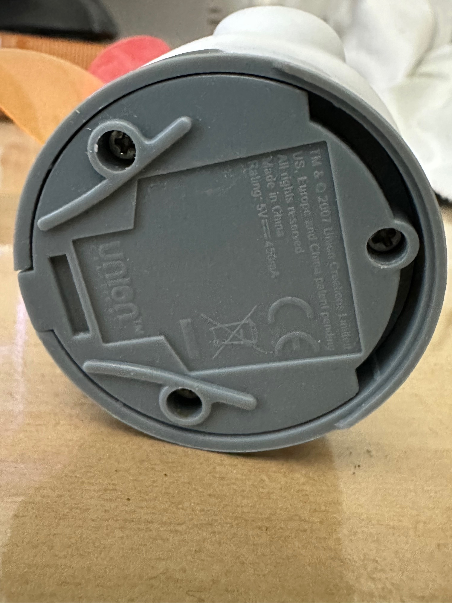
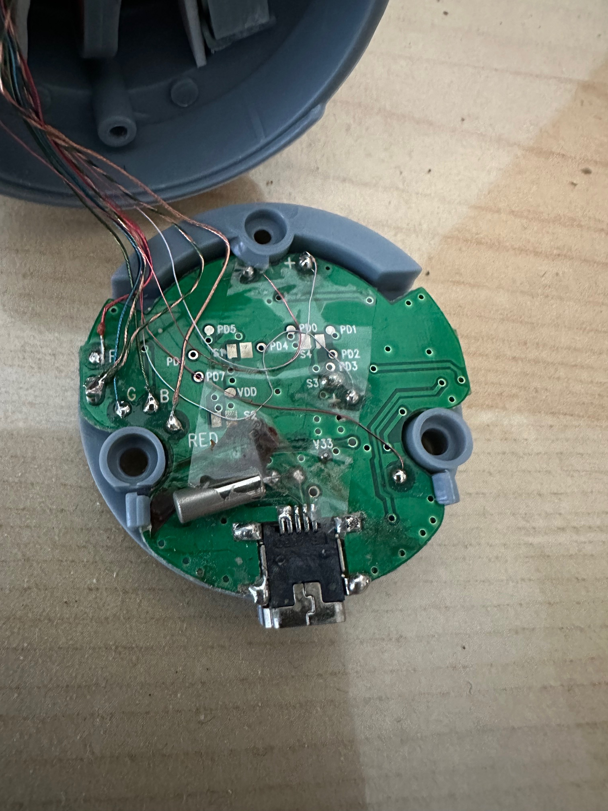
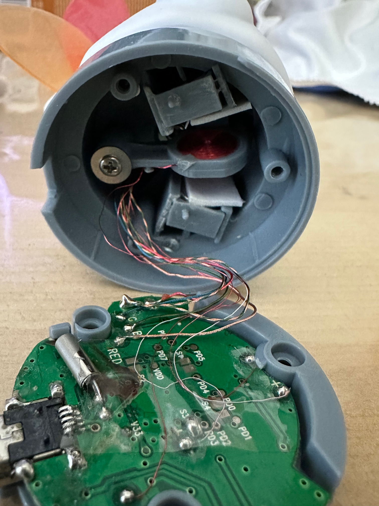

# iBuddy internals

One of the iBuddy dolls I had was malfunctioning, so I opened it op.

This document details how to open it and what can be found inside.

On the bottom of the iBuddy you can find three screws. Two of them are beneath
the little rubber feet that you have to remove first.

Inside there is a board, with a number of wires attached to it. These are for
the LEDs, the magnets for the wing flapping and wiggling. The board itself
seems to be glued to the bottom and cannot easily be removed.

Inside the iBuddy there are some magnets for flapping the wings and wiggling,
as well as LEDs. It looks like the wires for the LEDs are colour coded.

